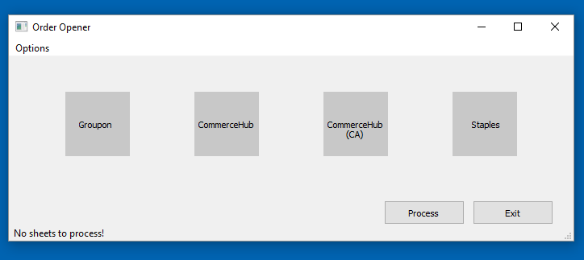

# SI_OrderOpener

</img>

A GUI application to automate the opening of orders to Lean Supply warehouse. Takes order queries from CommerceHub (Walmart, Best Buy, Staples), CommerceHub CA (The Source), Groupon, and Staples as inputs and combines them into a single output sheet formatted in a way that Lean Supply will accept. Connects to a sqlite database to fetch information on SKU and UPC codes.
 
## To-Do:
- Add Commercehub (CA)
- Automate Commercehub steps
   - Filter out opened, acknowledged, closed orders
   - Split into two separate sheets for Star Interactive and SBW
- Backorder checks
   - Check sku orders against current inventory
   - Generate report of backorders in each order
   - Running memory of backorders across time (weekly?)
- Add menubar options to update database
- Create MySQL table for Groupon descriptions and associated SKUs, add option to update to menubar
- Update db, fetch excel sheet from Lean Supply

